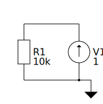
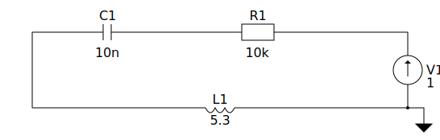
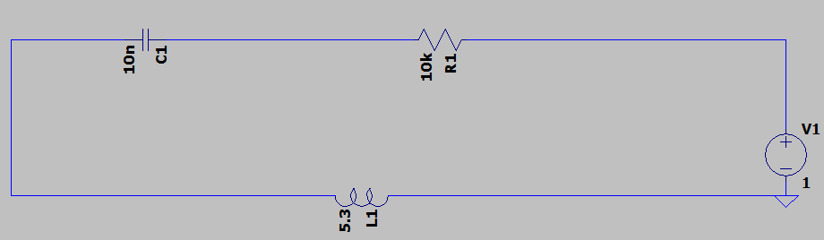
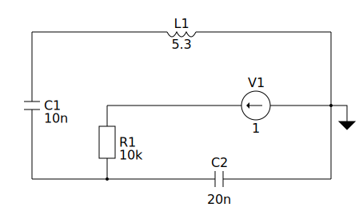

# netlist_converter
Program for visualization of spice netlists and conversion to visual format (.asc understandable by LTSpice).

## Building and running UTs

    mkdir build
    cd build
    cmake .. (or cmake .. -DCMAKE_BUILD_TYPE=Debug for verbose logging turned on)
    make run_uts

## Building and running app
Current output of app is svg file containing drawn layout (to be prettified) of parsed netlist
and full asc file.  
Directory *example* contains example netlists that can be successfully parsed.

    mkdir build
    cd build
    cmake .. (or cmake .. -DCMAKE_BUILD_TYPE=Debug for verbose logging turned on)
    make app
    ./app <netlist input file> <asc output file>

## Example inputs and outputs

    V1 vdd 0 1
    R1 vdd 0 10k

    V1 r 0 1
    R1 r c 10k
    C1 c l 10n
    L1 l 0 5.3

    V1 r 0 1
    R1 r c 10k
    C1 c l 10n
    L1 l 0 5.3
    C2 c 0 20n

